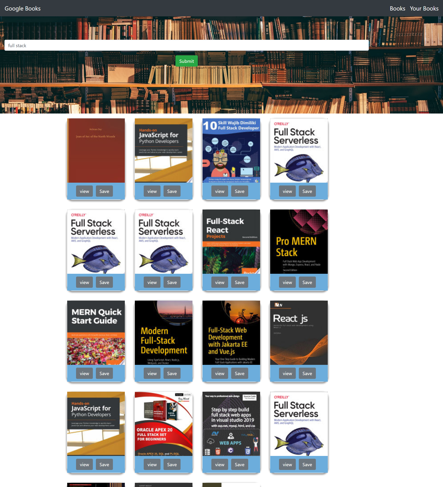

# Google Books

# Application Does:
* This is a full-stack application developed using the MERN tech stack.It gives user an ability to search different books based on his/her interest from google books API. User can save the interested books for the future reference rather than going through the whole search process.

# Technologies used:
* MERN(MongoDB, Express js, React, Node js)
* CSS , Bootstrap

# Features
* Using Google Books API
* show Books based on user interest
* User can save the book
* Link to google books
* User can delete the book

# Sample web page

 
 
# Heroku
https://guarded-ocean-54604.herokuapp.com/

# Github repository
 https://github.com/vsatyakavya/GoogleBooks

# contact Information
satyakavya24@gmail.com

@copyright 2020
